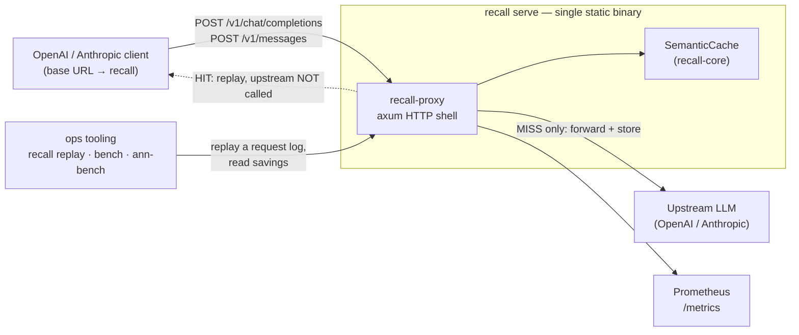
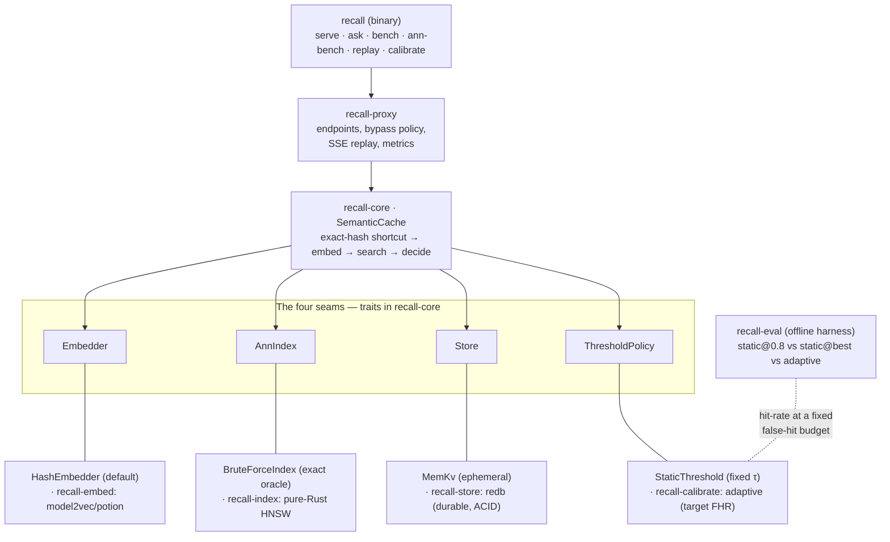
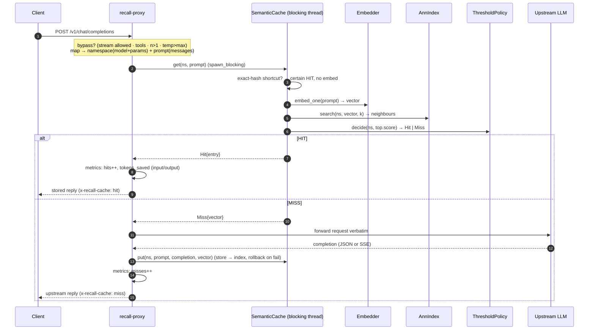
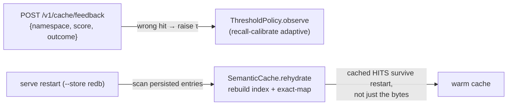
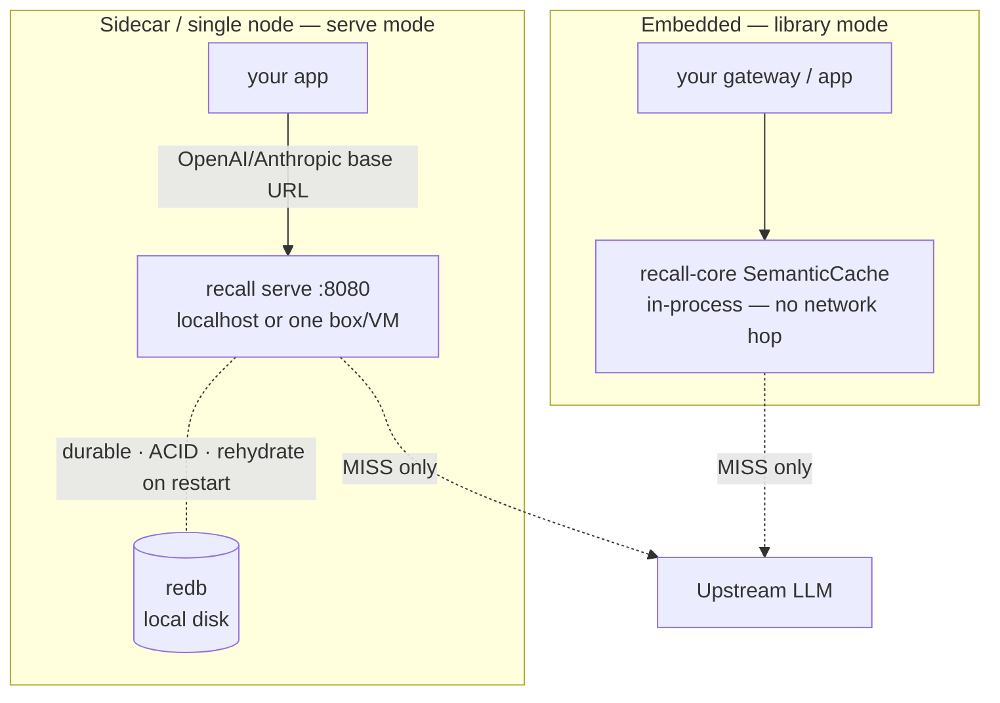
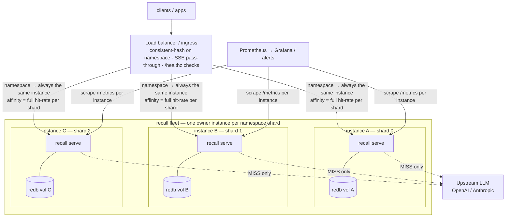

# recall — self-hosted, Rust-native semantic cache

`recall` is a semantic cache that sits in front of any OpenAI- or Anthropic-compatible LLM proxy and
answers one question on the hot path: *"have we already semantically answered a prompt close enough
to this one?"* On a hit it replays a stored completion without ever calling the upstream model; on a
miss it hands the caller back the query vector so the fresh completion is stored for next time. It is
a single static **Apache-2.0** binary — or an embeddable library — with no external vector database,
no mandatory network calls, and no Python supply chain.

> **Status (M1 done; M2 in progress, OSS alpha):** the MVP loop (embed → ANN search → threshold
> decision → hit/miss) runs end-to-end, and the proxy (`recall serve`) caches both OpenAI
> `/v1/chat/completions` and Anthropic `/v1/messages` (each in its own namespace partition) for
> **both non-streaming and streaming** requests. M2 so far adds an optional **static
> (model2vec/potion) embedder**, a durable **redb** store (`--store redb`, with **cross-restart
> lookup rehydration** — reopening rebuilds the in-memory index + exact-map from the persisted
> entries, so cached *hits* survive a restart, not just the blobs), the **adaptive threshold engine**
> (`--policy adaptive`, off by default), **streaming-cache replay** (a streamed completion is
> stored as raw SSE and replayed as a stream on a hit), and a pure-Rust **HNSW index** for scale
> (`--index hnsw` — sublinear and 14–25× faster at 50k entries, but its recall@1 ≥ 0.98 gate is
> validated only at low dimensionality; at the bundled 256-dim embedder's width it needs retuning —
> run `recall ann-bench` for your dims/N before opting in).

## Workspace crates

| Crate | What it is |
|---|---|
| `recall-core` | The four seams (`Embedder`/`AnnIndex`/`Store`/`ThresholdPolicy`) + `SemanticCache`. Default build pulls only `blake3` + `thiserror` — zero ML/network deps. |
| `recall-embed` | Real embedders. `static` feature = model2vec/potion (local-load, no network); default is a re-export of the deps-free `HashEmbedder`. |
| `recall-store` | Durable `Store` backends. `redb` feature = pure-Rust ACID (restart-surviving, no C deps); default build is deps-free. |
| `recall-calibrate` | The adaptive threshold engine: a feedback-driven `ThresholdPolicy` targeting a false-hit rate. Pure math, no deps. |
| `recall-index` | At-scale `AnnIndex`: a pure-Rust, zero-dependency HNSW graph (sublinear; recall@1 ≥ 0.98 holds at low dims — needs retuning at 256-dim, validate with `recall ann-bench`). No external ANN crate — stays in the air-gap envelope. |
| `recall-proxy` | OpenAI **and** Anthropic-compatible drop-in proxy + raw cache sidecar (axum). Caches non-streaming (JSON) and streaming (SSE) responses. |
| `recall` | The `recall` binary: `serve` (proxy), `ask`, `bench`, `ann-bench` (index scaling), `replay` (savings validation). |

## Architecture

recall is one binary wrapping one cache. The cache (`SemanticCache` in `recall-core`) is fixed; the
four things it needs — turn text into a vector, find near vectors, persist entries, decide hit-or-miss
— are **seams** (traits) with swappable implementations. Everything else (the proxy, the durable
store, the HNSW index, the adaptive threshold) plugs into those four seams.

### System context (high level)



The cache *is* the product; the proxy is just the network shell around it. A **hit** never touches the
upstream — that is where the latency and token savings come from.

### Components (the seams and what fills them)



Each seam has a deps-free default and a heavier opt-in impl behind a feature flag — so the default
build has zero ML / network / C dependencies (the air-gap property), and you escalate only the seam
you need.

### Request event/call flow



Two side flows feed the cache's quality and durability:



Feedback trains the adaptive threshold toward an operator-chosen false-hit rate; rehydration rebuilds
the in-memory index from the durable store so a restart keeps its hit-rate, not just its blobs.

### Deployment topology

The one fact that shapes every topology: in the **OSS build the index lives in-process** — each
`recall serve` owns its own in-memory ANN index + exact-map (durably backed by its *own* local redb,
rehydrated on restart). There is **no shared index across instances**; redb is single-writer, so a
volume belongs to exactly one live instance. A shared/hosted index that lets a whole fleet see every
entry is out of scope for this build. That gives two honest deployment shapes.

#### Small scale — single node (the OSS sweet spot)



One instance, vertical scale, local durable redb. Either embed `recall-core` straight into your
gateway (no extra process or hop), or run `recall serve` as a localhost sidecar your client points its
base URL at. This is where recall is meant to live for most users.

#### Large scale — HA partitioned fleet



Because there is no shared index, horizontal scale comes from **routing, not replication**: the LB
consistent-hashes on the namespace (tenant ⊕ model ⊕ params) so every request for a namespace lands on
the *same* instance — each instance owns a shard, keeps full hit-rate for it, and you add capacity by
adding shards. Each instance has its **own** durable volume; on node loss its shard rehydrates from
that redb on restart (or a warm standby that takes over the volume). Route `/v1/cache/feedback` with
the same affinity so the adaptive threshold trains on the instance that served the hit.

| | Small (single node) | Large (HA partitioned fleet) |
|---|---|---|
| Instances | 1 (or embedded library) | N, one owner per namespace shard |
| Routing | direct | LB consistent-hash on namespace |
| Index/state | in-process + local redb | per-instance, **not** shared |
| Scale axis | vertical | add shards (horizontal) |
| Node loss | restart → rehydrate from redb | standby on the volume, or rehydrate on restart |
| Caveat | — | LB must pass SSE through unbuffered; one writer per redb volume |

> **The simpler HA alternative** is round-robin **redundant** instances (no affinity): trivially
> available, but each instance only knows what *it* served, so the cache fragments — lower aggregate
> hit-rate and duplicate first-touch upstream calls. Choose it when availability matters more than
> hit-rate. A genuinely **shared** index — every node sees every entry, elastic, full hit-rate — is
> out of scope for this build.

## Why recall

- **In-process, single binary.** The cache *is* the product; the embedder, index, and threshold are
  pluggable seams behind it. No sidecar vector DB, no GC pauses in the tail, no C dependencies in the
  default build — the air-gap / single-supply-chain property compliance-bound deployments need.
- **Adaptive thresholds.** A single static cosine cutoff (the commonly documented `0.8`) is wrong
  across a real embedding space. recall's adaptive threshold targets an operator-chosen *false-hit
  rate* instead of a magic number, learning a separate cutoff per namespace. Reproduce the evidence
  with `cargo run -p recall-eval` — it runs `static@0.8` / `static@best` / adaptive over a
  controllable-density workload and reports hit-rate at a fixed false-hit budget.
- **Fast by construction.** A static (model2vec/potion) embedder runs in sub-millisecond time
  (~112 µs measured), and the in-process ANN + threshold adds only ~1.6 µs — a full cache hit measures
  **~113 µs p50 / ~258 µs p99**, single process, zero network hops. Reproduce the embed/search/decide
  split with `cargo bench -p recall-core` (criterion hot-path) and the flat-vs-HNSW crossover with
  `cargo bench -p recall-index`.

## Quick start

```bash
# from this module directory
cargo run -p recall -- bench               # synthetic FAQ workload: hit-rate + p50/p99 latency

# drive the loop by hand: a MISS reads the completion from stdin and stores it
echo "Use the 'Forgot password' link." | cargo run -p recall -- ask --ns demo "how do I reset my password"
```

What `bench` success looks like (real output, dev laptop, default deps-free hash
embedder — paraphrases only hit with a real `--model`, hence 50%: the exact half of
the query mix):

```text
recall bench  (embedder: hash-v1@256, policy: static@0.850)
  entries warmed  : 5
  iterations      : 2000
  hit-rate        : 50.0%  (1000/2000)
  embed  p50/p99  : 10.6 / 11.8 µs   (query → vector; embedder-bound)
  lookup p50/p99  : 22.9 / 26.2 µs   (full get: shortcut → embed → ANN → decide)
  index  p50      : ~12.3 µs   (lookup_p50 − embed_p50: in-process ANN + threshold)
  lookup max      : 39.0 µs
```

And the proxy loop (`recall serve` pointed at any OpenAI-compatible upstream; the
same request twice — the second never touches the upstream):

```text
$ curl -si http://127.0.0.1:8080/v1/chat/completions -d '…' | grep -iE "^HTTP|x-recall"
HTTP/1.1 200 OK
x-recall-cache: miss
$ curl -si http://127.0.0.1:8080/v1/chat/completions -d '…' | grep -iE "^HTTP|x-recall"
HTTP/1.1 200 OK
x-recall-cache: hit
x-recall-namespace: default:openai:Qwen/Qwen2.5-7B-Instruct:b4c28133aa120472
x-recall-score: 1
```

Reference docs: **[`docs/CONFIG.md`](./docs/CONFIG.md)** (every flag / `RECALL_*`
env / TOML key in one table) · **[`docs/API.md`](./docs/API.md)** (all endpoints,
headers, cache-hit semantics, metrics, the library entry points) ·
**[`docs/OPERATIONS.md`](./docs/OPERATIONS.md)** (deploy, state & backup, upgrade,
monitoring, symptom-first troubleshooting, security posture).

### Run as an OpenAI- or Anthropic-compatible proxy

```bash
# Point the proxy at your upstream(s); then point your OpenAI/Anthropic client's base URL at it.
export RECALL_UPSTREAM_API_KEY=sk-...           # OpenAI key — env only, never a flag
export RECALL_ANTHROPIC_API_KEY=sk-ant-...      # Anthropic key — env only, never a flag
cargo run -p recall -- serve --config recall.toml
#   GET  /healthz                 → "ok"
#   GET  /metrics                 → Prometheus (hit-rate, tokens saved, …)
#   POST /v1/chat/completions     → OpenAI: hit replays the stored reply; miss forwards upstream & stores
#   POST /v1/messages             → Anthropic Messages: same hit/miss/store, Anthropic-correct keying & auth
#   POST /v1/cache/{lookup,insert}→ raw sidecar for non-OpenAI/Anthropic callers
#   POST /v1/cache/feedback       → report a served hit's outcome (agree|wrong) to train the
#                                   adaptive threshold: {namespace, score, outcome}

# Each response carries `x-recall-cache: hit | miss | miss-nostore | bypass`.
# `miss-nostore` means the upstream responded but the reply was not cached at header time (non-2xx,
# or a non-JSON/non-SSE body). A *streamed* reply always carries `miss` (the header precedes the
# body); if that stream then ends without its clean terminator (`[DONE]`/`message_stop`) or with a
# truncation finish reason, it is simply not stored — the next identical request misses again, and
# `recall_stream_not_stored_total` counts the drop. A HIT also carries `x-recall-score`
# (the similarity) and `x-recall-namespace` (the server-derived cache key) — feed those straight back
# to POST /v1/cache/feedback to train the adaptive threshold from OpenAI/Anthropic traffic, no
# client-side key reconstruction needed. Tool-call, n>1 (OpenAI), and temperature > max_temperature
# requests bypass the cache. Streaming (`"stream": true`) IS cached: a miss tees the upstream SSE to
# the client as it arrives while filling the cache buffer, and a hit replays the stored stream
# chunk-by-chunk — in a namespace disjoint from the non-streaming one (so the two formats never
# cross-replay). OpenAI traffic forwards to RECALL_UPSTREAM; Anthropic traffic to
# RECALL_ANTHROPIC_UPSTREAM (default https://api.anthropic.com, with anthropic-version 2023-06-01).
```

Use the deterministic hash embedder by default, or the real static embedder by building with
`--features static` and pointing `--model` at a local model2vec/potion directory (offline; no
download). The ANN index is exact brute force by default (`--index brute`, the recall oracle); at
scale the pure-Rust HNSW (`--index hnsw`, no extra dependency) is sublinear — but run `ann-bench`
for your dims/N first: its recall@1 ≥ 0.98 gate has not been validated at the 256-dim production
width. For a cache that survives restarts, build with
`--features store-redb` and run
`recall serve --store redb --db-path /var/lib/recall/cache.redb` (pure-Rust ACID, no C deps); the
default in-memory store is ephemeral. On startup `serve` **rehydrates** — it re-derives each
persisted entry's vector and rebuilds the in-memory index + exact-map, so cached hits (not just the
stored bytes) survive the restart; the startup log reports `rehydrated N/M cached lookups`. To opt
into the adaptive threshold, add
`--policy adaptive --target-fhr 0.02`: it learns a per-namespace cutoff toward that false-hit rate
from feedback. Feed it via `POST /v1/cache/feedback` (`{namespace, score, outcome: "agree"|"wrong"}`)
— a served hit judged `wrong` raises that namespace's cutoff. Raw-sidecar callers get the `namespace`
and `score` from `/v1/cache/lookup`; OpenAI/Anthropic proxy callers get them from the `x-recall-namespace`
and `x-recall-score` headers on the hit response (no key reconstruction needed). Absent any feedback it
rests at the cold-start τ, so it is safe to enable and behaves like the static cutoff until it learns.
Config precedence is **flag > env (`RECALL_*`) > `--config` file > default**.

## Use it as a library

```rust
use recall_core::{SemanticCache, HashEmbedder, BruteForceIndex, MemKv, StaticThreshold,
                  Namespace, Lookup};

let cache = SemanticCache::new(
    HashEmbedder::default(),     // swap for a real model2vec/potion embedder behind a feature flag
    BruteForceIndex::new(),      // swap for recall_index::HnswIndex at scale
    MemKv::new(),                // swap for redb/fjall for durability
    StaticThreshold::new(0.9),   // swap for the adaptive per-region policy
);
let ns = Namespace::new("tenant-a/chat")?;

let prompt = "How do I reset my password?";
if let Lookup::Miss { vector } = cache.get(&ns, prompt)? {
    // ... call the real LLM, then store the answer (reuses the query vector, no second embed) ...
    cache.put(&ns, prompt, "Click 'Forgot password'.", &vector)?;
}
# Ok::<(), recall_core::RecallError>(())
```

Every backend decision (real embedder, HNSW, durable store, adaptive threshold) is a swap-an-impl
task behind the four traits in `recall-core` — `Embedder`, `AnnIndex`, `Store`, `ThresholdPolicy`.

## Security model

Namespace isolation is **structural** (you cannot reach another partition) but **not
authenticated** — if you map a tenant from a client header without verifying it, a client can spoof
another tenant's namespace. recall does not ship authenticated multi-tenant isolation. Do
not deploy it as a multi-tenant *trust* boundary. See
[docs/OPERATIONS.md](./docs/OPERATIONS.md) for the full security posture.

## Contributing

Contributions are accepted under the Developer Certificate of Origin (a `Signed-off-by` line,
`git commit -s`).

## License

Licensed under the Apache License, Version 2.0. See [LICENSE](./LICENSE) and [NOTICE](./NOTICE).
